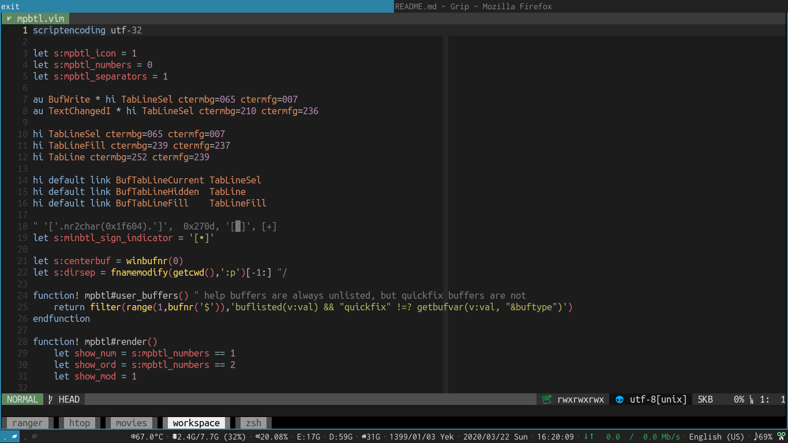
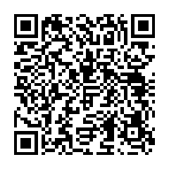

<h1 align="center">
	
    <br/>
    <h4 align="center">Using mpbtl + <a href="https://github.com/LinArcX/mpi">mpi</a> + <a href="https://github.com/LinArcX/mpsl">mpsl</a></h4>
</h1>

## Installation
Just copy `mpbtl.vim` into your `plugin` directory.

## Why?
- [KISS](https://en.wikipedia.org/wiki/KISS_principle)
- I like [vim-airline](https://github.com/vim-airline/vim-airline). But its code is huge for such a simple task.(showing statusline)
- I like to manipulate and discover things and see what's going on under the hood(And i encourage you, too). So, instead of just using a huge plugin, install a minimal alternative and change it according to your needs.

## Customization
There are three main settings in mpbtl. And you can change them by settting them to 0(disable) or 1(enable):

```
let s:mpbtl_icon = 1
let s:mpbtl_numbers = 0
let s:mpbtl_separators = 1
```

Tip: This version of mpbtl uses icons from [mpi](https://github.com/LinArcX/mpi).


### Define custom colors
If you want to use different colors, first you should define different `Highlight commands`. Here is an example:

```
hi TabLineSel ctermbg=065 ctermfg=007
hi TabLineFill ctermbg=239 ctermfg=237
hi TabLine ctermbg=252 ctermfg=239
```

Here is the list of colors: https://jonasjacek.github.io/colors/

## Donate
- Monero: `48VdRG9BNePEcrUr6Vx6sJeVz6EefGq5e2F5S9YV2eJtd5uAwjJ7Afn6YeVTWsw6XGS6mXueLywEea3fBPztUbre2Lhia7e`


## License

